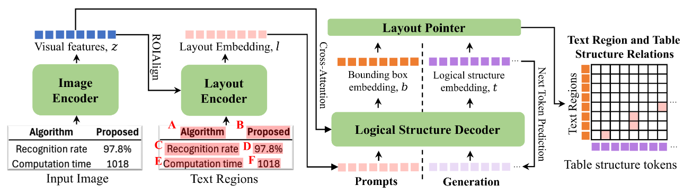

# TFLOP: Table Structure Recognition Framework with Layout Pointer Mechanism
<strong>Official implemenetation of</strong> "TFLOP: Table Structure Recognition Framework with Layout Pointer Mechanism" (IJCAI 2024)



## 📣 Latest Updates

- 💻 [17/01/2025] Release of TFLOP code!
- 🚀 [15/10/2024] Try out the enterprise-grade integration of TFLOP within Upstage’s Document Parse -- [[Link](https://console.upstage.ai/playground/document-parse)]
- ⚡️ [03/08/2024] Presentation of TFLOP in IJCAI 2024 -- [[Paper](https://arxiv.org/abs/2501.11800)]

## 🚀 Getting Started
### Installation
```bash
# Create a new conda environment with Python 3.9
conda create -n tflop python=3.9
conda activate tflop

# Clone the TFLOP repository
git clone https://github.com/UpstageAI/TFLOP

# Install required packages
cd TFLOP
pip install torch==2.0.1 torchmetrics==1.6.0 torchvision==0.15.2
pip install -r requirements.txt
```
### Download required files
1. install & login huggingface

reference: https://huggingface.co/docs/huggingface_hub/en/guides/cli
```bash
pip install -U "huggingface_hub[cli]"
huggingface-cli login
```
2. install git-lfs
```bash
sudo apt install git-lfs
git lfs install
```
3. download dataset from [huggingface](https://huggingface.co/datasets/upstage/TFLOP-dataset)
```bash
git clone https://huggingface.co/datasets/upstage/TFLOP-dataset
```
Directory Layout
```bash
├── images
│   ├── test.tar.gz
│   ├── train.tar.gz
│   └── validation.tar.gz
├── meta_data
│   ├── erroneous_pubtabnet_data.json
│   ├── final_eval_v2.json
│   └── PubTabNet_2.0.0.jsonl
└── pse_results
    ├── test
    │   └── end2end_results.pkl
    ├── train
    │   ├── detection_results_0.pkl
    │   ├── detection_results_1.pkl
    │   ├── detection_results_2.pkl
    │   ├── detection_results_3.pkl
    │   ├── detection_results_4.pkl
    │   ├── detection_results_5.pkl
    │   ├── detection_results_6.pkl
    │   └── detection_results_7.pkl
    └── val
        └── detection_results_0.pkl
```
4. unzip image files
```bash
cd TFLOP-dataset
cd images
tar -xvzf train.tar.gz
tar -xvzf validation.tar.gz
tar -xvzf test.tar.gz
```
5. download pretrained weights
```bash
mkdir pretrain_weights
cd pretrain_weights
git clone --branch official https://huggingface.co/naver-clova-ix/donut-base-finetuned-cord-v2
```
### Data preprocessing
1. preprocess dataset with pse result
```bash
bash scripts/preprocess_data/preprocess_pubtabnet.sh
```
2. You can get TFLOP-dataset/meta_data/dataset_train.jsonl, TFLOP-dataset/meta_data/validation.jsonl
```bash
TFLOP-dataset
├── images
│   ├── test
│   ├── train
│   ├── validation
├── meta_data
│   ├── dataset_train.jsonl
│   ├── dataset_validation.jsonl
│   ├── erroneous_pubtabnet_data.json
│   ├── final_eval_v2.json
│   └── PubTabNet_2.0.0.jsonl
└── pse_results
    ├── test
    ├── train
    └── val
```

### Training
```bash
bash scripts/training/train_pubtabnet.sh
```

### Evaluation
```bash
bash scripts/testing/test_pubtabnet.sh <bin_idx> <total_bin_cnt> <experiment_savedir> <epoch_step>
python evaluate_ted.py --model_inference_pathdir <experiment_savedir>/<epoch_step> \
                       --output_savepath <experiment_savedir>/<epoch_step>

# Example
bash scripts/testing/test_pubtabnet.sh 0 1 results/pubtabnet_experiment/expv1 epoch_29_step_231000
```

## Acknowledgement
We would like to express our gratitude for the outstanding works that have served as valuable references in this research:
- [Donut](https://github.com/clovaai/donut) repository for architecture implementation
- [SupContrast](https://github.com/HobbitLong/SupContrast) repository for Contrastive Learning implementation
- [PubTabNet](https://github.com/ibm-aur-nlp/PubTabNet/blob/master/src/metric.py) repository for TED implementation


## Citation
```
@inproceedings{khang2024tflop,
  title={TFLOP: table structure recognition framework with layout pointer mechanism},
  author={Khang, Minsoo and Hong, Teakgyu},
  booktitle={Proceedings of the Thirty-Third International Joint Conference on Artificial Intelligence},
  pages={947--955},
  year={2024}
}
```